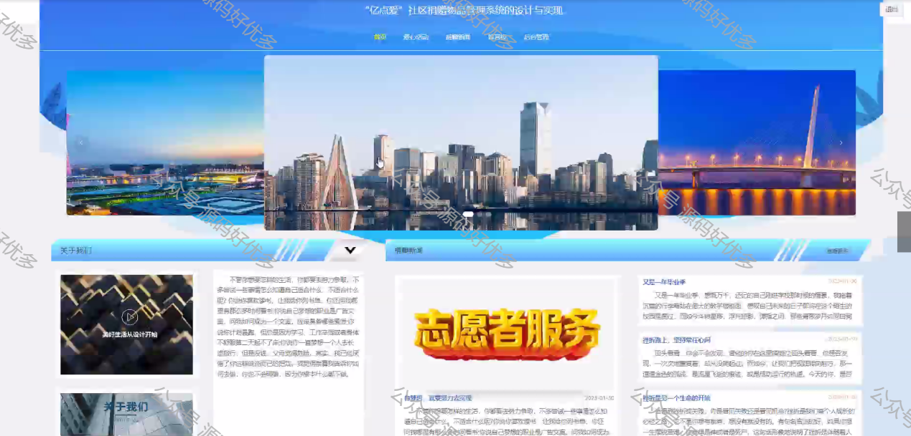
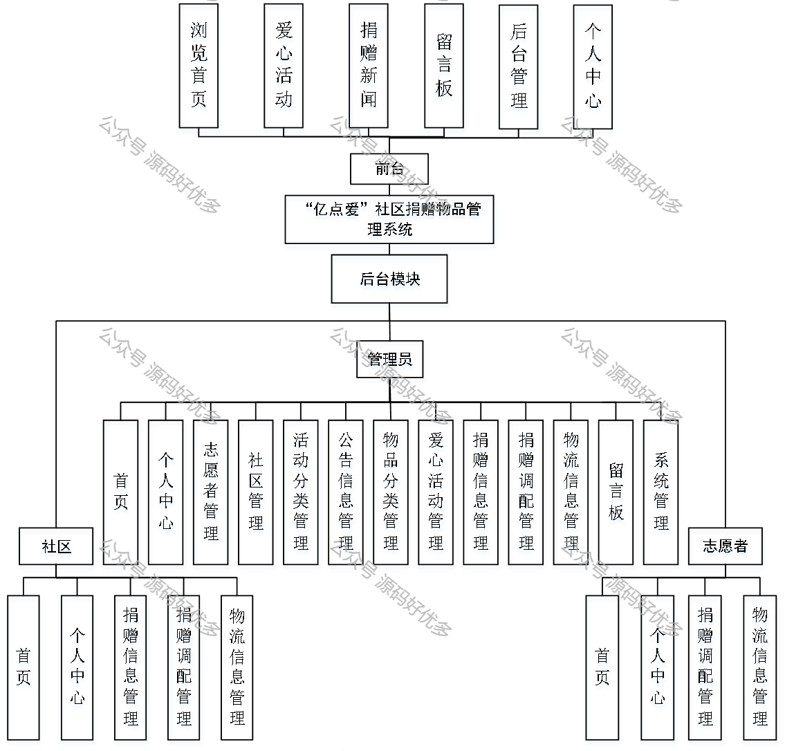
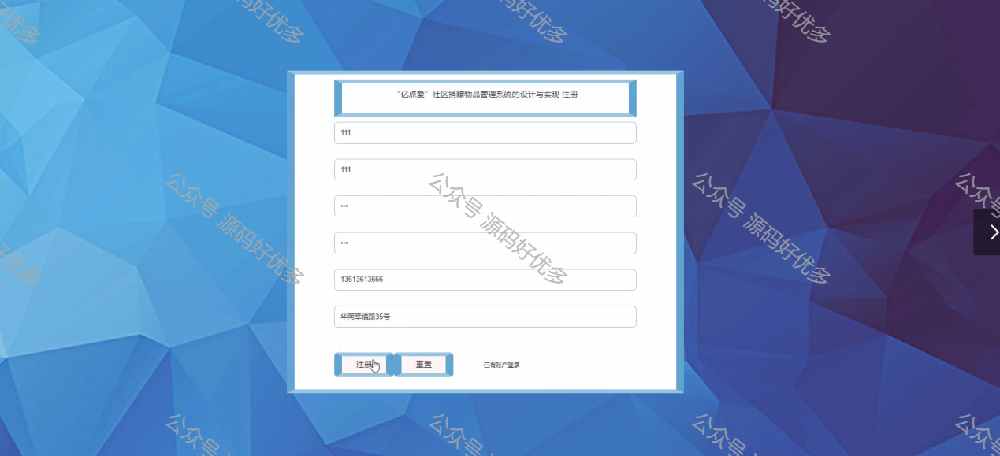
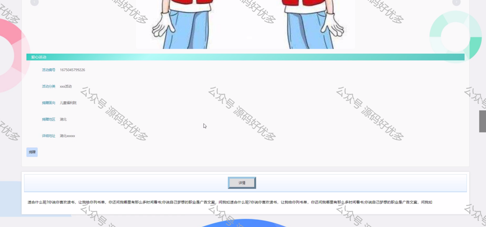
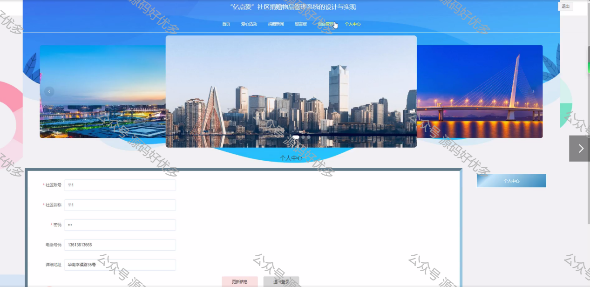
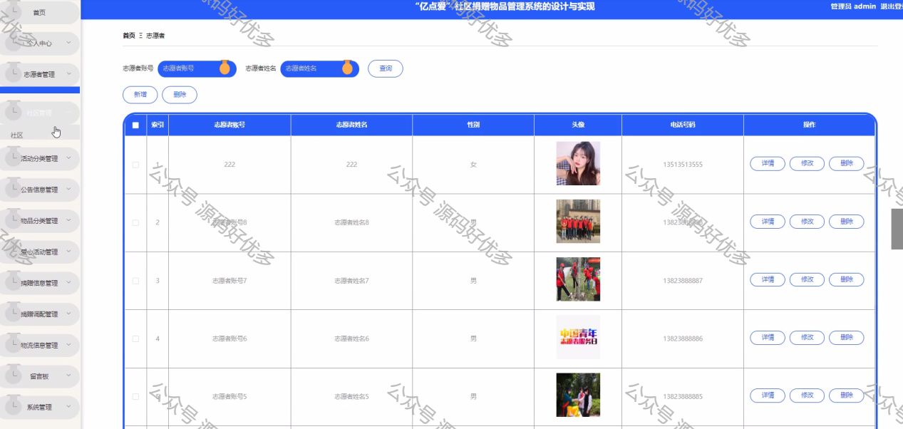
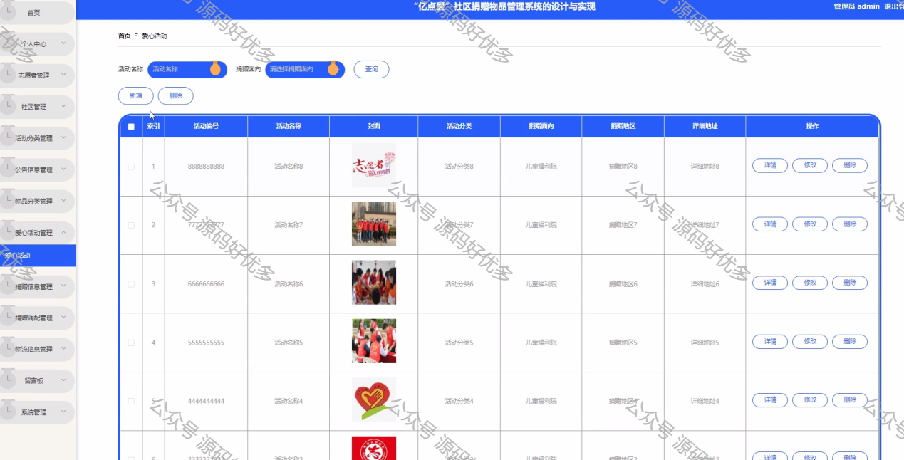

 
## 查看主页获取源码

> **作者介绍**： **✌**全网粉丝10W+本平台特邀作者、博客专家、CSDN新星计划导师、java领域优质创作者,博客之星、掘金/华为云/阿里云/InfoQ等平台优质作者、专注于毕业项目实战 **✌**

  

### 一、作品包含

源码+数据库+设计文档万字LW+PPT+全套环境和工具资源+部署教程

### 二、项目技术

前端技术：Html、Css、Js、Vue、Element-ui

数据库：MySQL

后端技术：Java、Spring Boot、MyBatis

  

### 三、运行环境

开发工具：IDEA/eclipse

数据库：MySQL5.7

数据库管理工具：Navicat10以上版本

环境配置软件： JDK1.8+Maven3.6.3

前端Nodejs：14

  

### 四、项目介绍
项目编号：springbootA065

通过对知识内容的学习研究，进而设计并实现一个“亿点爱”社区捐赠物品管理系统。系统能实现的主要功能应包括；志愿者信息、社区信息、活动分类、公告信息、物品分类、爱心活动、捐赠信息、捐赠调配、物流信息、留言板等的一些操作，传统的管理模式主要是使用纸作为介质，信息交流很大程度上受地域的影响，在当今信息技术发达的现状下，完全无法满足高效率的，快节奏的现代工作生活的需要。现代化网络管理模式主要是利用网络技术，将传统的以纸作为介质的信息资源保存到网络数据库中，在需要用到的时候直接通过网络到数据库中获取，无论何时何地都不受影响，完全满足现代工作生活的高效率的需求。

### 五、运行截图

